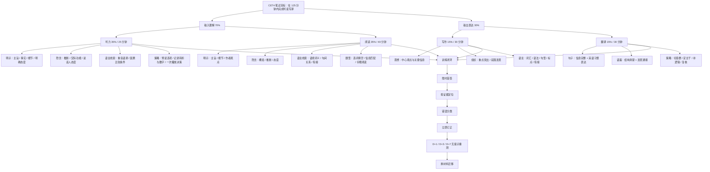

# 四级两周学习系统

版本：2026-09-22
执行窗口：2026-09-23 至 2026-10-06（也可把“第 1 天”平移到你的实际开始日）

## 0. 先说清楚：这套系统依据什么

### 已确认

- 教育部教育考试院公布的 CET4 笔试结构为：写作 15% / 30 分钟；听力 35% / 25 分钟；阅读 35% / 40 分钟；翻译 15% / 30 分钟；总计 125 分钟。[官方考核内容](https://cet.neea.edu.cn/html1/report/16123/196-1.htm)
- 官方大纲把能力目标界定为听力理解、阅读理解、写作、翻译和口头表达；本系统只覆盖 CET4 **笔试**，不把口试混进两周计划。[官方考试大纲页面](https://cet.neea.edu.cn/xhtml1/folder/16113/1588-1.htm)
- 工作区有 2024/12、2025/06、2025/12、2026/06 共 12 套 CET4 卷及第三方解析；本计划主要使用最近两次的 6 套卷，早期 6 套留作加练与迁移测试。[资料库说明](../README.md)

### 用户已确认的学习合同

- 实际弹性容量：每天至少 2 小时，但日计划按用户要求只设 **0.5 小时保底**，其余为可选扩展，不制造每日满载压力。
- 计划考试日：**2026-12-12**，这是用户提供的日期；截至本次检索，教育部教育考试院官网尚未检索到对应的 2026 年下半年报名公告，因此最终仍须以官方公告和准考证为准。
- 目标：不是“过线”，而是尽可能高分，为 CET6 与 IELTS 铺垫；执行主目标定为 **630+**，冲刺目标 **650+**。
- 当前状态：尚未做第一次真题；先完成导学，再开始首轮刷题。
- 课程标准：用户确认没有额外讲义、指定阅读、课程题集或历次小测；《全国大学英语四、六级考试大纲》同时作为课程标准、能力标准和命题边界。

## 0.1 分数目标怎样解释

- CET4 报道总分满分为 **710**；听力满分 249、阅读满分 249、写作和翻译合计满分 212。
- 官方采用常模参照报道分，**不设官方及格线**，因此不能把 CET 分数当作简单卷面百分制。
- 高考 135/150 是 90%；若只做算术类比，90% × 710 ≈ **639**。但两种考试量尺不同，这个数字只能表达目标强度，不能预测 CET 报道分。
- 按官方四级常模百分位表：590 约为第 90 百分位、610 约第 95、630 约第 98、650 约第 99。因此本系统采用：`高分参照 590+ / 主目标 630+ / 冲刺 650+ / 理论上限 710`。

来源：[教育部教育考试院“分数解释”](https://cet.neea.edu.cn/xhtml1/folder/19081/5124-1.htm)。

## 1. 概念图

概念图上层来自官方大纲与官方卷面结构；“训练闭环”和具体操作步骤是本系统的学习设计，不是官方考点声明。官方大纲明确的四级要求包括：听懂 120–140 词/分钟的较慢广播、熟悉话题会话与讲话报道；仔细阅读约 70 词/分钟、快速阅读约 100 词/分钟；30 分钟写不少于 120 词；30 分钟将 140–160 个汉字的熟悉题材段落译成英语。[官方大纲 PDF](https://cet.neea.edu.cn/res/Home/1704/55b02330ac17274664f06d9d3db8249d.pdf)

## 2. 精简学习指南

### 2.1 考试结构与两周资源分配

| 板块 | 官方结构 | 两周训练抓手 | 主要来源 |
|---|---:|---|---|
| 写作 | 15%，30 分钟，1 题 | 审题—立场—两点论证—复核；每篇做 30 分钟首稿与 10 分钟改稿 | 官方结构；2025/12 与 2026/06 各套卷 PDF 第 1 页 |
| 听力 | 35%，25 分钟，25 题 | 预读选项；抓人物—动作—因果—转折—数字；按新闻/长对话/篇章分错因 | 2026/06 第 1、2 套 MP3 与卷面 PDF 第 1–4 页 |
| 阅读 | 35%，40 分钟，30 题 | 先词性与搭配，再强锚点匹配，最后主旨/细节/推断/态度证据定位 | 2026/06 第 1 套 PDF 第 5–10 页 |
| 翻译 | 15%，30 分钟，1 题 | 切意群、定主谓、选择自然搭配、补连接、反向核对遗漏 | 2025/12 与 2026/06 各套卷末页 |

资源投入按官方分值先保证听力与阅读，再保证两项输出；但不要把 35/35/15/15 机械换成每天的时间比例——你的短板数据尚未提供。

### 2.2 听力：一遍播放时如何做决定

1. 播放前只做两件事：圈选项差异；预测问题类型（人/事/原因/结果/态度/数字）。
2. 播放中记录“主语 + 动作 + 转折后信息”，不抄完整句。
3. 题干出现后，用录音证据选最完整的同义改写；选项只复现一个词但改变主语、因果或范围时判为陷阱。
4. 错题归因只用以下代码：`L-SOUND` 辨音；`L-DETAIL` 细节丢失；`L-LOGIC` 因果/转折；`L-PARA` 同义替换；`L-ATT` 态度；`L-PACE` 来不及。

证据：官方大纲要求理解主旨、重要事实和细节、隐含意义、交际功能与说话人观点态度，并能利用语音特征和句间关系；2026/06 第 1 套卷面说明每段与问题只播放一次。[官方大纲 PDF](https://cet.neea.edu.cn/res/Home/1704/55b02330ac17274664f06d9d3db8249d.pdf)；[2026/06 第1套真题](../materials/CET4/2026/06/第1套/真题.pdf)

### 2.3 阅读：三种题型三条主线

- 选词填空：先判词性槽，再看搭配，再用语义方向裁决。例：2026/06 第 1 套第 26 题由谓语位置、过去时和 `squeeze ... from ...` 锁定 `squeezed`；第三方解析见 PDF 第 62 页。
- 长篇匹配：先找唯一性强的数字、专名、反常搭配，再做同义替换；弱锚点题留到最后。2026/06 第 1 套第 44 题被第三方解析标为弱锚点，其余多数为强锚点，适合训练“先强后弱”。
- 仔细阅读：题干先判主旨/细节/推断/态度；答案必须能回指句子。错误选项常见为以偏概全、无中生有、程度升级、主客体互换、因果偷换。

证据：官方阅读技能包括主旨、细节、观点态度、隐含意义、语境猜词、句间关系和篇章衔接。[官方大纲 PDF](https://cet.neea.edu.cn/res/Home/1704/55b02330ac17274664f06d9d3db8249d.pdf)；[2026/06 第1套真题](../materials/CET4/2026/06/第1套/真题.pdf)；[第三方答案解析](../materials/CET4/2026/06/第1套/答案解析.pdf)

### 2.4 写作：30 分钟可复现流程

- 0–4 分钟：在题干中圈任务、对象、立场维度；写一句中心判断和两条理由。
- 4–24 分钟：三段或四段成文。每段第一句承担功能，例子只服务观点。
- 24–30 分钟：检查是否回答了题目全部维度、是否 120–180 词、主谓一致/时态/单复数/拼写/连接是否正确。
- 自评四维：任务完成、组织连贯、语言准确、词数格式。每维 0–2，满分 8；这是本系统的训练量表，不是官方换算分。

官方要求是中心明确、结构基本完整、用词较恰当、语句通顺、语意连贯，30 分钟不少于 120 词。工作区近卷写作提示常见“提议回应/校园问题/观点表达”，但这只是现有样本，不等于保证未来只考这些提示形式。[2026/06 第1套真题，第1页](../materials/CET4/2026/06/第1套/真题.pdf)

### 2.5 翻译：从“逐字对齐”改成“信息块交付”

1. 用斜线切 4–6 个意群，给每个意群确定主语和谓语。
2. 优先表达事实关系，再选择自然搭配；中国特色表达可解释，不硬凑字面对等。
3. 用从句、分词、介词短语或并列连接意群，但每句先保证主干完整。
4. 回看中文逐项勾信息：时间、数字、因果、转折、递进、评价不能漏。
5. 自评四维：信息完整、语言准确、英语自然、篇章连贯；每维 0–2。本量表仅用于训练。

官方要求四级将 140–160 个汉字、涉及中国文化/历史/社会发展的熟悉题材段落译成英语，基本准确、通顺、句式和用词较恰当。[官方大纲 PDF](https://cet.neea.edu.cn/res/Home/1704/55b02330ac17274664f06d9d3db8249d.pdf)

## 3. 间隔练习规则

每个错题或薄弱产出进入同一复习队列：

- `D0`：看完解析后合上答案，立即重做一次。
- `D+1`：无提示重做；只记录对/错与信心，不先看笔记。
- `D+3`：换顺序或换同类材料重测，防止只记住选项位置。
- `D+7`：延迟重测；正确且信心 ≥ 3/4 才算“暂时掌握”。
- 再错：回到 `D+1`，并把错误从“答案错”改写成可操作原因，如“未看 although 后的结论”，不能只写“粗心”。

优先级缩放：

- 每天 **30 分钟保底**：这是计划承诺，不因当天有 2 小时容量就自动加满。
- 当天想继续时扩展到 60 分钟：完成一个完整题型或一个输出任务。
- 精力和时间都允许时扩展到 120 分钟以上：做迁移练习、深度复盘或阶段模拟。
- 完整 CET4 笔试需要 125 分钟，另需约 20–25 分钟初步复盘；只有能连续投入时才安排，不能把分段练习标成完整模拟。
- 导学阶段不追求刷题量。先知道大纲要求“考什么、做到什么程度、如何判定证据”，再进入第一次真题。

## 4. 14 天日历

| 天 | 日期 | 阶段 | 30 分钟保底 | 扩展到 60 分钟 | 使用 120 分钟以上容量 | 可验证产出 |
|---:|---|---|---|---|---|---|
| 1 | 09-23 周三 | 导学1：课程标准与分数 | 读大纲定位、卷面结构、常模分数；完成 G01–G03 | 手绘四板块结构与分值 | 建立“官方要求 / 系统方法 / 未验证”三栏笔记 | 能解释 710、无及格线、630+/650+目标 |
| 2 | 09-24 周四 | 导学2：听力 | 学官方听力目标、三种材料与一次播放流程；G04/G09 | 只分析 Directions 和选项差异，不正式作答 | 听 1 段时同时看文字稿，标明主旨、细节、转折、态度 | 一张听力证据清单，不记录正确率 |
| 3 | 09-25 周五 | 导学3：阅读 | 学三种题型和官方阅读技能；G05/G08 | 用已公开示例演示“词性槽—锚点—证据句” | 拆 3 个长句并复述逻辑关系 | 阅读题型决策树 |
| 4 | 09-26 周六 | 导学4：写作 | 学官方要求、审题四问、30分钟流程；G06 | 对 W01 只做审题与三段提纲，不写全文 | 比较两个立场提纲，检查任务维度 | 一页写作检查表 |
| 5 | 09-27 周日 | 导学5：翻译 | 学官方要求、意群切分、信息核对；G07 | 对 T01 只切意群和定主谓，不写全文 | 对其中 3 句做多种表达比较 | 一页翻译检查表 |
| 6 | 09-28 周一 | 导学6：考场系统 | 学作答顺序、时间边界、错误代码；G10–G12 | 模拟填写一次答题记录，不碰完整真题 | 制作个人答题页：时间、信心、证据、错因 | 可直接复用的答题记录模板 |
| 7 | 09-29 周二 | 导学结业检查 | 闭卷完成 G01–G12；错题立即重答 | 口述四板块“考什么—怎么做—怎么验” | 若未达 10/12，回看相应大纲目标；达标才进入首刷 | 导学分数 ≥10/12；首刷准入 |
| 8 | 09-30 周三 | 第一次刷题：听力 | 2026/06 第1套 Q1–10，一遍作答并记信心 | 加证据回听与 L01–L10 订正 | 完成 Q1–25，逐题写错因；不要做第二套 | 第一份真实首答数据 |
| 9 | 10-01 周四 | 第一次刷题：阅读A/B | V01–V10 首答，先写词性槽 | 加 M01–M10，先强锚点后弱锚点 | 全部订正并建立 D+1/D+3/D+7 队列 | 选词/匹配首答正确率与用时 |
| 10 | 10-02 周五 | 第一次刷题：仔细阅读 | R01–R05 首答，写题型与定位句 | 加 R06–R10 | 逐项解释错误选项为什么错 | 仔细阅读首答正确率、证据定位率 |
| 11 | 10-03 周六 | 第一次输出：写作 | W01 限时 30 分钟，只写首稿 | 用 8 分量表自评并修订 | 写 W02 提纲；提取重复错误 | 原稿、量表、修订稿 |
| 12 | 10-04 周日 | 第一次输出：翻译 | T01 限时 30 分钟 | 检查信息块并修订 | 用 T02 做 3 句迁移，不完成全文 | 原稿、漏译率、修订稿 |
| 13 | 10-05 周一 | 首轮复盘 | 重做已到期 D+1/D+3 项，更新错因 | 汇总四板块 Top 3 瓶颈 | 针对最低项做一组换材料迁移 | 首答与复测对照、瓶颈清单 |
| 14 | 10-06 周二 | 第一次整卷 | 30 分钟先做考前流程回忆；若无连续时段则改为复测日 | 不建议用 60 分钟把整卷硬拆后称为模拟 | 使用一次连续约150分钟容量：2025/12 第1套，125分钟作答+25分钟初复盘 | 首次完整基线；若分段则明确标注非模拟 |

说明：Day 1–7 是导学，不把看解析或跟做示范记成“刷题正确率”。Day 14 听力必须一次播放；若当天没有连续 150 分钟，则顺延完整模拟，保底任务仍算完成。

## 5. 进度判定

不要用“看了几页”“学了多久”替代能力证据。每个板块至少保留以下指标：

| 指标 | 计算 | 两周内看什么变化 |
|---|---|---|
| 首答正确率 | 首次正确数 / 已答客观题数 | 诊断 vs 第13天同类题 |
| 延迟正确率 | D+7 正确数 / D+7 重测数 | 是否真正记住而非刚看完解析 |
| 证据定位率 | 能写出定位句/信号的正确题 / 正确题 | 是否从猜中变成可解释 |
| 超时数 | 超过板块时限仍未完成的题数 | 阅读40、听力25、写作30、翻译30内是否完成 |
| 写作重复错误 | 同类语法/任务遗漏在下一篇再次出现次数 | 应下降 |
| 翻译信息遗漏率 | 漏掉的信息块 / 原文信息块 | 应下降 |
| 迁移正确率 | 换套卷后正确数 / 换套卷题数 | 是否只记住原题 |

客观题“暂时掌握”标准：D+7 正确、能解释证据、信心 ≥ 3/4。主观题“暂时掌握”标准：不看模板，能在限时内完成，且任务完成/组织/语言/格式（翻译为信息/准确/自然/连贯）四维均不低于 1/2。

## 6. 题库与工作簿

题库包含 58 个条目：大纲导学 12、听力 10、选词填空 10、信息匹配 10、仔细阅读 10、写作 3、翻译 3。导学题先建立标准，真题正文主要通过“套卷 + 题号 + PDF 页”定位。答案与简析放在独立工作表，防止做题时偷看。

- 可阅读版：[`题库与解析.md`](题库与解析.md)
- 可填写版：[`CET4_两周学习系统.xlsx`](CET4_两周学习系统.xlsx)

## 7. 两周之后到考试日

从 2026-09-23 到计划考试日约 80 天；本文件只展开最初 14 天。后续建议分为：

1. 10-07 至 11-03：基础能力期——按首次基线决定听/读/写/译权重，保留每日 30 分钟底线。
2. 11-04 至 11-24：组合训练期——每周至少一次两板块连做，每两周一次完整模拟。
3. 11-25 至 12-08：模考与稳定期——完整模拟、错因复测、时间策略固定。
4. 12-09 至 12-11：减量期——只复习已验证错误与流程，不开新材料。

第一次整卷之前不预设你的强弱项；Day 14 的真实数据将决定下一周期，而不是用“高分目标”反推虚假的当前水平。
